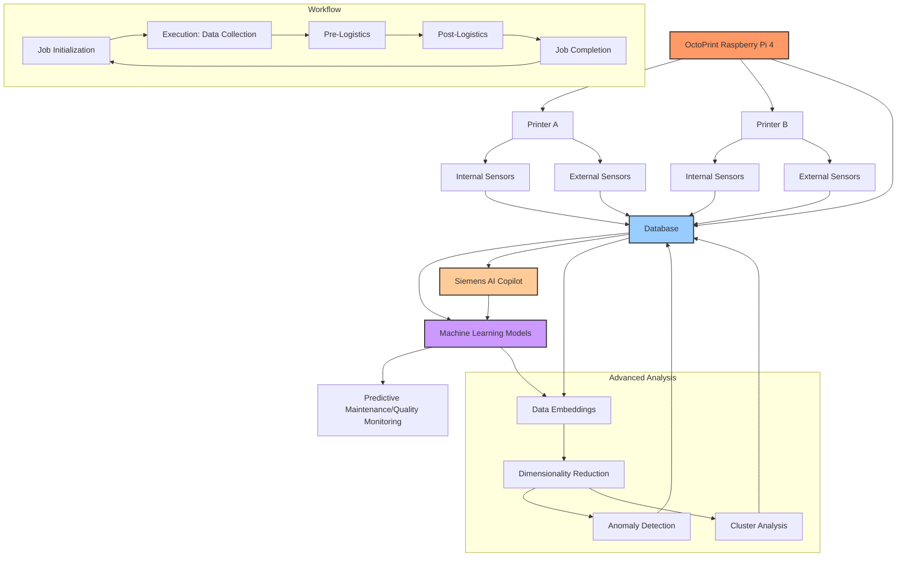

```mermaid
graph TD
    %% System Architecture Section
    A[OctoPrint Raspberry Pi 4] --> B[Printer A]
    A --> C[Printer B]
    A --> D[Database]
    B --> E1[Internal Sensors]
    B --> E2[External Sensors]
    C --> F1[Internal Sensors]
    C --> F2[External Sensors]
    D --> G[Machine Learning Models]
    G --> H[Predictive Maintenance/Quality Monitoring]

    %% Workflow and Job Management Section
    subgraph Workflow
        I[Job Initialization]
        J[Execution: Data Collection]
        K[Pre-Logistics]
        L[Post-Logistics]
        M[Job Completion]
        I --> J
        J --> K
        K --> L
        L --> M
        M --> I
    end
    
    %% Data Flow and Machine Learning Integration Section
    E1 --> D
    E2 --> D
    F1 --> D
    F2 --> D
    D --> N[Siemens AI Copilot]
    N --> G

    %% Multidimensional Data Representation Section
    subgraph Advanced Analysis
        O[Data Embeddings]
        O --> P[Dimensionality Reduction]
        P --> Q[Anomaly Detection]
        P --> R[Cluster Analysis]
    end
    
    D --> O
    G --> O
    Q --> D
    R --> D

    %% Labels for Clarification
    A:::octoprint
    D:::database
    G:::ml
    N:::ai
    style A fill:#f96,stroke:#333,stroke-width:2px
    style D fill:#9cf,stroke:#333,stroke-width:2px
    style G fill:#c9f,stroke:#333,stroke-width:2px
    style N fill:#fc9,stroke:#333,stroke-width:2px
    classDef octoprint fill:#f96,stroke:#333,stroke-width:2px
    classDef database fill:#9cf,stroke:#333,stroke-width:2px
    classDef ml fill:#c9f,stroke:#333,stroke-width:2px
    classDef ai fill:#fc9,stroke:#333,stroke-width:2px

```

